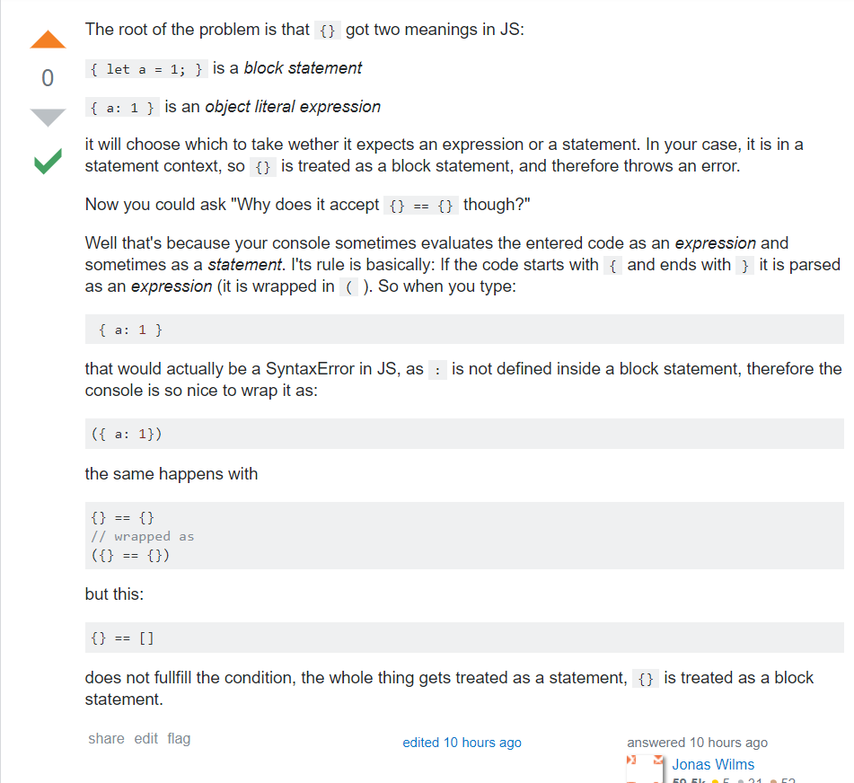

```js
[] == []        // false
[] == ![]       // true
{} == !{}       // false
[] == !{}       // true
![] == {}       // false  
{} == ![]       // VM1896:1 Uncaught SyntaxError: Unexpected token ==
({}) == ![]     // false   
``` 

&emsp;&emsp;刚开始看到这几道题有点懵，好吧，js基础还是不太好。经过一番谷歌，算是应该弄懂了吧。涉及到各种ECMAScript规定，所以直接放总结出干货了。    

### ==的运算规则：    
1. String/Boolean == Number，String/Boolean先转换为Number。    
2. String == Boolean，两个操作数都先转换为Number。   
3. Object == Primitive，Object先转为Primitive。


&emsp;&emsp;以经典的`[]==![]`为例，可以拆解为一下几个过程：（1）`[] == ![]`, 先对[]进行取非逻辑运算，而 ![] 转换成的无疑是false，因为 [] 和 {} 都为true（见犀牛书P49，规定是这么规定，我觉得是因为[]和{}虽然是空的，但里面本来就包含了各种数据类型方法。会转化为false的就只有五个: undefined, null, 0, NaN, '')。（2）`[] == false`,根据ECMAScript规定，此时先将false转化为数字，即0。（3）`[] == 0`, toPrimitive([]）将空数组转换为原始数据类型''（详细过程见下，toPrimitive({})则转化为[object Object]）。(4)`'' == 0`, 显然先将可以得到 `0 == 0`,即最后结果true了。

### toPrimitive()：
&emsp;&emsp;将对象转化为原始数据类型，接受两个参数。第一个是要转化的对象，第二个是要转化成的类型（Number, String），默认是Number（犀牛书P52）   
1. 转化为字符串： 先调用toString(),如果没有toString方法或返回的不是一个原始值，则再调用valueOf()。若得到一个原始值则返回，否则抛出异常。   
2. 转化为数字： 先调用valueOf(),如果没有valueOf方法或返回的不是一个原始值，则再调用toString()。若得到一个原始值则返回，否则抛出异常。
3. 默认的valueOf方法简单地返回对象本身,数组、函数和正则表达式使用默认的valueOf方法，所以valueOf([])放回一个空字符串。
  
   
	
&emsp;&emsp;同理可得其他的运算结果，要注意的是:
`![]=={}   //false`    和  `{}==![]   //VM1896:1 Uncaught SyntaxError: Unexpected token `。刚开始看的时候我也是觉得很奇怪，就左右互换了个位置而已，咋就报错了呢？我没想到的是，在`{}==![]`里{}被当作是代码块来处理了，所以自然就报错了。根据StackOverflow里某位daolao的回复，就是如果代码是以 { 开头以 } 结尾，就会被解析成表达式，否则就是代码块了，而以!开头的都会被认为是表达式。详情见下图：
   

---
本节完，如果有后续再另行补充。